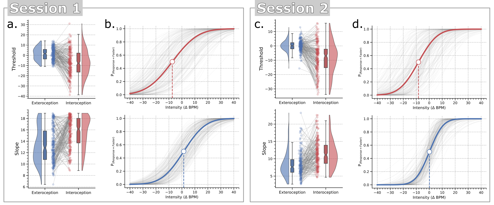
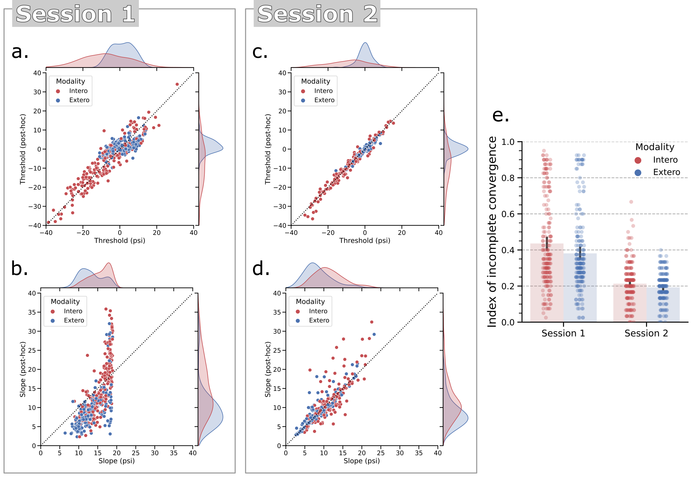
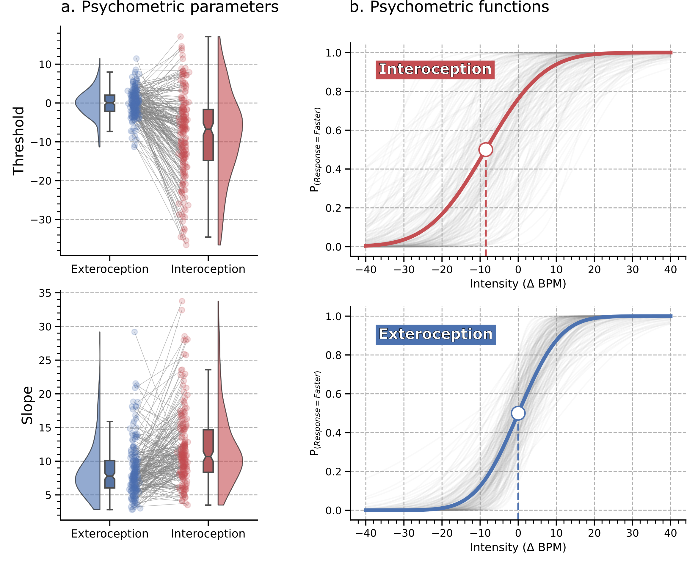
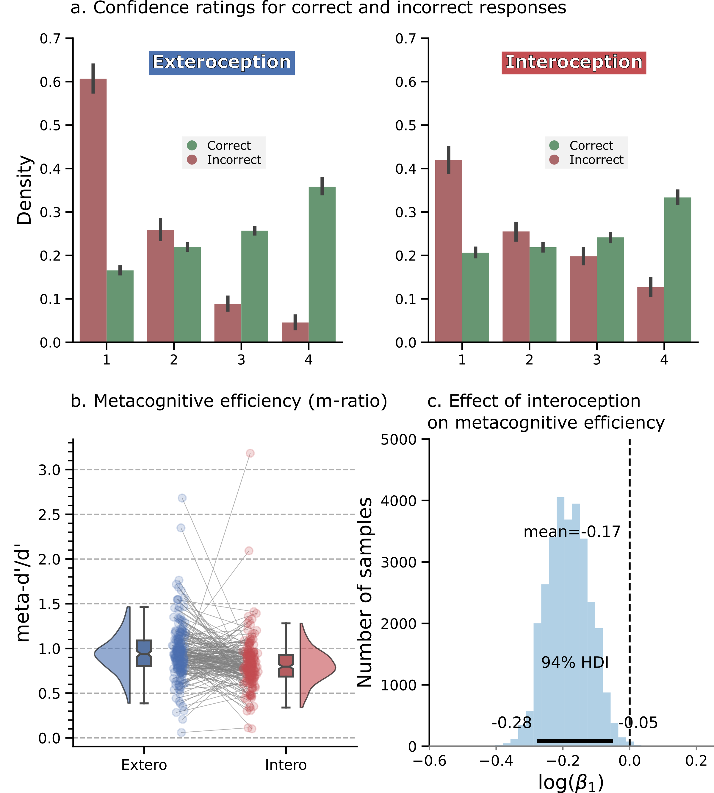
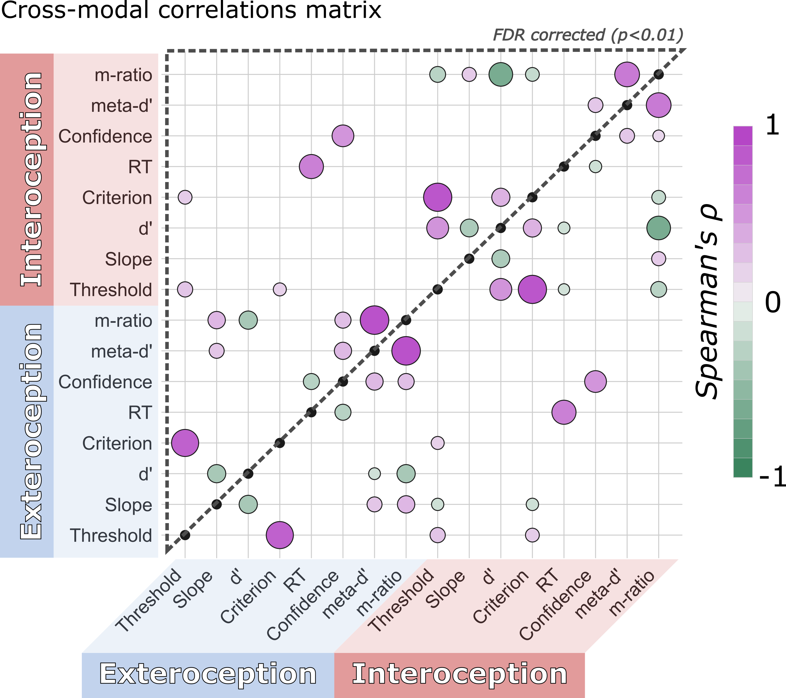

# Cardioception Method Paper

This repository contain data, code, figures and HTML quality reports supporting the results presented in the cardiac interoception (cardioception) method paper.

>Legrand, N., Nikolova, N., Correa, C., Brændholt, M.,Stuckert, A., Kildahl, N., Vejlø, M., Fardo, F., Allen, M. (2021) Measuring the Accuracy and Precision of Interoceptive Beliefs: A Novel Psychometric Bayesian Approach.
***
## Data

Raw and summarized data are stored in the `data` folder. The `raw` folder contains the raw data for the three tasks (Heartbeat Counting and 2 sessions of Heart Rate Discrimination). The HRD data frames are filtered for physiological signal outliers (see the `HeartRateDiscrimination.ipynb` notebook for details). The HBC contains reports (`.txt` files) and PPG recordings (`.npy` files). The following summary data frames are also provided:

* `behavior.txt`: summary statistics for group-level analysis.

* `dates.csv`: individual schedule for Session 1 and 2.

* `Del1_merged.txt` and `Del2_merged.txt`: concatenated behavioural results at the trial level for session 1 and session 2 (HRD task).

* `Del1_psychophysics` and `Del2_psychophysics`: psychophysics parameters estimated using Psi and a post-hoc Bayesian method for session 1 and session 2 (respectively).

* `demographics.csv`: age and sex of the participants.

* `hbc.txt` scores at the Heartbeat Counting task (trial level).
  
* `jagsSamples_Del1.txt` and `jagsSamples_Del2.txt`: Subject-level trace samples from the JAGS repeated measures model.

* `jagsStats_Del1.txt` and `jagsStats_Del2.txt`: summary statistics (beta values) from the JAGS repeated measures model.

* `metacognition_trials.txt`: confidence responses in long format (Session 1 and Session 2).

* `metadprimeHmetad.txt`: meta-d' scores from the subject level fit (R).
  
* `responsesRatings.txt`: Discretized confidence ratings in long format (Session 1 and Session 2).

* `sdt.txt` Signal Detection Theory metrics (Session 1 and Session 2).

* `Summary.txt` Data summary for Session 1 and Session 2 used for the cross-modal correlation matrices.

***
## Code

### Notebooks

The following notebook can be used to go through the whole analysis pipeline. The figures, or the figure components, are generated along the way. You can either inspect the notebooks using the *nbviewer* badge or run the entire repository interactively using  .

#### Analysis
 * `1-Preprocess_Demographics.ipynb`  Contains basic files import and summary. Demographics reports

 * `2-Psychophysics.ipynb`  Psychometric functions parameter analysis using Psi or post-hoc Bayesian estimates.

 * `3-Metacognition.ipynb`  Analysis of the type 2 task results (using RJAGS).

 * `4-HBC.ipynb`  HBC task results and correlations.

 * `5-Correlations.ipynb`   Cross-modal correlations, test-retest reliability results.

#### Templates

The following notebooks are used as templates to create the HTML reports for each tasks (see the `/reports/` folder). It helps to visualize results and can perform basic outlier detection(rejection (e.g. HRD).

 * `HeartBeatCounting.ipynb`  Subject level report template for the heartbeat counting task.

 * `HeartRateDiscrimination.ipynb`  Subject level report template for the heart rate discrimination task.

### Scripts

The following scripts are called from the analysis notebooks, or should be run externally to process the data (can be long).

#### Python

* `reports_HBC.py` and `reports_HRD.py` generate HTML reports for the HBC and the two session of the HRD tasks (respectively).

* `plotting.py` raincloud plot for repeated measures.

#### R

* `run_individualLevel.R` run the hmeta-d model at the individual level.
  
* `run_RepeatedMeasures.R` run the hmeta-d model - paired sample t test.
  
* `Function_metad_1wayANOVA.R` run the hmeta-d model at the group level with repeated measures.

#### JAGS

* `Bayes_metad_indiv.txt` JAGS model for individual fit of the H-Meta-d model.

* `Bayes_metad_1wayANOVA.txt` JAGS model for simple paired sample t test fit of the H-Meta-d model.

***
## Reports

* The `/reports/` folder contains HTML reports for both tasks (HRD and HBC).
  
***
## Figures

### Figure 1:

**A. Heart Rate Discrimination Trial Design (Session 1).** Participants were presented with 160 trials testing their exteroceptive (blue) and interoceptive (red) accuracy and precision (80 in each condition in randomised interleaved order). During interoceptive trials, participants were instructed to attend to their own heart rate for 5 seconds, while it was recorded using a pulse oximeter. The average heart rate for the trial was then computed and used to select the frequency of the tones presented during the decision phase, increased or decreased by an intensity value generated by the staircase, i.e. 𝚫-BPM. During exteroceptive trials, a sequence of tones was presented to the participant with a frequency randomly chosen between 40 and 100 BPM. This frequency was then used to select the beeping frequency of the tones presented during the decision phase, increased or decreased by a value generated by the staircase procedure. 𝚫-BPM values were controlled by separate staircases for each condition. To estimate metacognitive ability for each modality, at the end of each trial, participants were asked to rate their subjective decision confidence (from 0 - guess to 100 - certain). **B. Staircases for each condition from an exemplary subject.** Trials rated as faster or slower are depicted with circles or squares respectively. The shaded area represents the 95% CI of the threshold posterior distribution. On the right panel, the resulting cumulative normal distribution is plotted using the final parameters estimated by the Psi procedure.

### Figure 2:

**Psychometric parameter estimates and fitted interoception and exteroception psychometric functions (Session 1). A.** Repeated measures raincloud plots visualizing threshold and slope parameters of the psychometric functions across the two modalities (interoception and exteroception). Data points for every individual are connected by a grey line to highlight the repeated measure effect. **B.** The grey lines show individual subject fits. The dark red and blue lines show the grand mean psychometric function, depicting averaged threshold and slope. Grand mean thresholds are marked by the large point, where the psychometric function crosses 0.5 on the ordinate axis. We observed a strong effect of interoception on both slope and threshold as compared to the exteroceptive control condition. The negative bias observed on threshold demonstrates that participants underestimated their heart rate on average. The greater slope indicates a less precise decision process. 

### Figure 3:

**Visualization of metacognitive performance for interoception and exteroception conditions (Session 1). A.** Histogram showing the distribution of binned confidence ratings for correct versus error trials. Participants were significantly less confident overall in the interoceptive condition and showed reduced calibration as indicated by the flattening of the confidence distributions. **B.** To quantify this effect, we estimated “metacognitive efficiency”, a signal theoretic model of introspective accuracy which controls for differences in type 1 (discrimination) performance. Here, an M-ratio of 1 indicates optimal metacognition according to an ideal observer model, whereas values lower than this indicate inefficient use of the available perceptual signal. This model demonstrated that metacognitive efficiency was substantially decreased for interoceptive relative to exteroceptive judgements. **C.** Histogram of posterior samples from the beta value coding the effect of interoception.
 

### Figure 4:

**Cross-modal correlation heatmap of task parameters for interoception and exteroception conditions (Session 1).** Overall, we observed that behavioural results were correlated within modalities but with limited dependence across modalities, the only exceptions were confidence and response time (RT). Only significant skipped Spearman correlations are represented. The upper triangle only shows results surviving FDR correction (pFDR < 0.01). Colour and size of individual points indicate the sign and strength of estimated correlation coefficients. See supplementary Fig 4 for Session 2 cross-correlations. 

### Figure 5:

**Correlation between the psychometric threshold and heartbeat counting performance. (Session 1) A.** We found that heart rate discrimination (HRD) thresholds correlate positively with heartbeat counting (HBC) interoceptive accuracy scores. A lower threshold (i.e., a more negative bias) on the HRD task was associated with a lower performance on heartbeat counting. We suggest that low scores on the heartbeat counting task are associated with a tendency to undercount the number of heartbeats. **B.**The psychometric threshold was associated with the total number of heartbeats reported during the heartbeat counting task. The correlation was also found while controlling for the heart rate during the task (not shown). These results suggest that participants’ inability to reliably count their heartbeats is partially explained by lower interoceptive thresholds. Outliers detected by the skipped correlation are reported in red. The rs and p values are from the bootstrapped Spearman coefficient. The regression line is only fitted to non outlier data points. The shaded area represents the bootstrapped confidence interval (95%).

### Figure 6:

**Test-retest reliability of the psychometric threshold. The psychometric threshold estimated using a Bayesian post hoc approach provided correct test-retest reliability. A.** Correlation between the interoception threshold estimates in Sessions 1 and 2 (n=179). Outliers detected by the skipped correlation are removed and the reliability is tested using a Pearson correlation. The rs and p values are from the bootstrapped Spearman coefficient. The regression line is only fitted to non-outlier data points. The shaded area represents the bootstrapped confidence interval (95%). **B.** Distribution of threshold Bayesian estimates across sessions and modalities (n=204 for Session 1; n=190 for Session 2).

***

### Supplementary Material 1

**Psychometric parameters and psychometric functions estimated by the staircase using the Psi method from Sessions 1 and 2.** Slope and threshold parameters of the psychometric functions for interoception (red) and exteroception (blue) conditions during Session 1 (n=205) (**A.**) and Session 2 (n=187) (**C.**). Psychometric functions fitted across interoceptive and exteroceptive conditions for Session 1 (**B.**) and Session 2 (**D.**). The grey lines show individual subject fits. The dark blue and red lines show the grand mean psychometric function, depicting average threshold and slope. Both sessions show a strong effect of interoception on slope and threshold as compared to the exteroceptive control condition. The threshold was negatively biased during interoception and the slope was larger, indicating a less precise accuracy.

### Supplementary Material 2

**Comparison between online and post hoc Bayesian estimation of slope and threshold parameters of the psychometric functions.** Adaptive Bayesian staircases can be biased if their initial parameter settings poorly fit the underlying generative psychometric function, or if a subject makes unrepresentative responses early in the experiment. For example, in this sample we observed that the prior width [0 - 20] on the slope parameter was too low, resulting in a ceiling effect that biased estimates for some subjects. One solution to control for these biases is to implement post hoc Bayesian modelling of the observed psychophysical data. We thus re-analyzed the responses for each participant and for each condition separately using a Bayesian model to fit a cumulative normal distribution. **A.** The thresholds estimates remained stable, although with a reduced variance for the exteroceptive condition. **B.** The ceiling effect on the slope is normalized by the post hoc modelling, which shifts the posterior mass away from the extremes. The post hoc procedure can thus improve the estimation of the interoceptive and exteroceptive psychophysical parameters.

### Supplementary Material 3

**Psychometric parameter estimates and fitted interoception and exteroception psychometric functions (Session 2). A.** Repeated measures raincloud plots visualizing threshold and slope parameters of the psychometric functions across the two modalities (interoception and exteroception). Data points for every individual are connected by a grey line to highlight the repeated measure effect. **B.** Psychometric functions fitted across interoceptive and exteroceptive conditions. The grey lines show individual subject fits. The dark red and blue lines show the grand mean psychometric function, depicting averaged threshold and slope. Grand mean thresholds are marked by the large point, where the psychometric function crosses 0.5 on the ordinate axis. We observed a strong effect of interoception on both slope and threshold as compared to the exteroceptive control condition.

### Supplementary Material 4

**Visualization of metacognitive performance for interoceptive and exteroceptive conditions (Session 2). A.** Histogram showing the distribution of binned confidence ratings for correct vs error trials. Participants were significantly less confident overall in the interoceptive condition and showed reduced calibration as indicated by the flattening of the confidence distributions. To quantify this effect, we estimated “metacognitive efficiency”, a signal theoretic model of introspective accuracy which controls for differences in type 1 (discrimination) performance. Here, an M-ratio of 1 indicates optimal metacognition according to an ideal observer model, whereas values lower than this indicate inefficient use of the available perceptual signal. **B.** This model demonstrated that metacognitive efficiency was substantially decreased for interoceptive relative to exteroceptive judgements. **C.** Histogram of posterior samples from the beta value coding the effect of interoception.

### Supplementary Material 5

**Cross-modal correlation heatmap of task parameters for interoception and exteroception conditions (Session 2).** We replicated several of the observations reported from Session 1. Behavioural results were correlated within modalities but with limited dependence across modalities, the only exceptions, already observed in Session 1, were confidence and response time (RT). Only significant skipped Spearman correlations are represented. The upper triangle only shows results surviving FDR correction (pFDR < 0.01). Colour and size of individual points indicate the sign and strength of estimated correlation coefficients.
